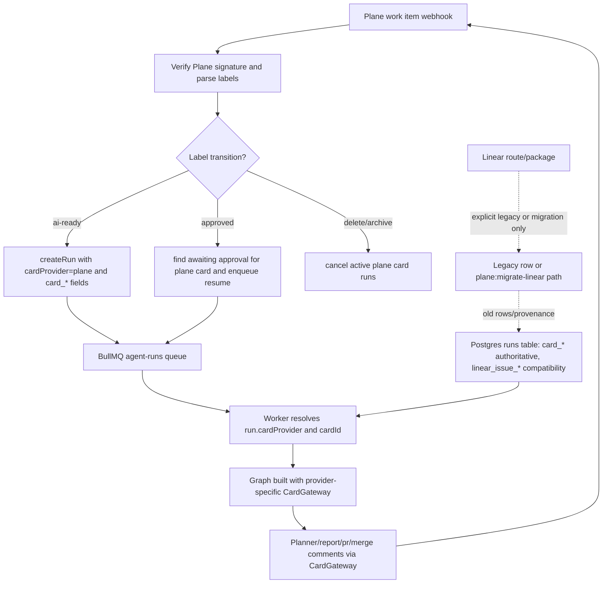

# Phase 03: Plane-Only Provider Cutover - Research

**Researched:** 2026-07-02
**Domain:** TypeScript provider cutover, webhook/runtime compatibility, Drizzle schema compatibility
**Confidence:** HIGH for codebase-local findings; MEDIUM for framework documentation findings

<user_constraints>
## User Constraints (from CONTEXT.md)

All bullets in this section are copied from `.planning/phases/03-plane-only-provider-cutover/03-CONTEXT.md`. [VERIFIED: .planning/phases/03-plane-only-provider-cutover/03-CONTEXT.md]

### Locked Decisions

## Implementation Decisions

### Provider Cutover Scope
- Plane is the only active provider for new intake, approval, reports,
  auto-merge labels, scheduler-created cards, and card-run history.
- Linear support may remain only as a documented legacy/migration path for old
  rows and Linear-sourced Plane provenance.
- Runtime defaults, tests, docs, and env examples should stop enabling
  `CARD_EXTRA_PROVIDERS=linear`.
- Active runtime fallbacks should prefer generic card fields or Plane; fallback
  to `linear` is allowed only when the row explicitly identifies `cardProvider:
  'linear'` or a migration command is operating on Linear-origin data.

### Compatibility Strategy
- Retain `linear_issue_id` and `linear_issue_identifier` fields during this
  phase as compatibility columns for existing rows.
- Add or update tests proving existing legacy rows still resolve through generic
  card fields or an explicit migration-only compatibility branch.
- Dashboard SQL and operator docs should prefer `card_identifier`; legacy Linear
  fields may appear only as fallbacks or historical labels.
- Dropping or renaming DB columns/indexes is out of scope until a production data
  audit and migration confirmation exist.

### Test-First Requirements
- Add Plane-focused characterization tests before removing active Linear paths.
- Cover Plane webhook intake, approval resume, report/comment routing,
  auto-merge label behavior, scheduler-created cards, and card-run history.
- Update env validation tests so Plane-only defaults pass without Linear secrets
  and enabling Linear explicitly requires legacy env.
- Keep migration tests for `plane:migrate-linear` and Linear-origin Plane
  provenance.

### Documentation and Operations
- Update README, architecture, runbooks, and secrets docs to state Plane-only
  active operation.
- Move Linear wording from "optional provider" to "legacy/migration-only" unless
  the code path is still intentionally active.
- Document rollback/migration notes for any retained compatibility behavior.
- Keep historical Linear-first docs indexed as history rather than rewriting
  them as current guidance.

### the agent's Discretion
The agent may choose the smallest safe implementation path that satisfies the
phase success criteria. If a change would permanently delete route support,
package support, schema columns, or historical records, stop and request
destructive cleanup confirmation instead of proceeding silently.

### Deferred Ideas (OUT OF SCOPE)

- Dropping/renaming legacy DB columns and indexes is deferred pending production
  data audit and explicit destructive confirmation.
- Deleting `packages/linear`, `@linear/sdk`, or `/webhooks/linear` entirely is
  deferred pending explicit destructive confirmation.
- Removing `coder-agent` compatibility aliases is deferred to Phase 4 unless
  required by the Plane-only cutover.
</user_constraints>

<phase_requirements>
## Phase Requirements

| ID | Description | Research Support |
|----|-------------|------------------|
| PLN-01 | Code inventory identifies every Linear dependency in source, tests, docs, env examples, database fields, and eval fixtures. | Phase 1 inventory already classifies Linear references; this research refreshes active source, tests, docs, env, schema, dashboard, and build-artifact surfaces. [VERIFIED: .planning/phases/01-bootstrap-and-architectural-inventory/01-INVENTORY.md] [VERIFIED: codebase grep] |
| PLN-02 | Plane is the only active card-provider path after migration/removal, unless a documented compatibility shim is proven necessary. | Runtime entry points to cut over are `cards.ts`, `env.ts`, `webhooks.ts`, `queue.ts`, `worker.ts`, `agent.ts`, and `scheduleWorker.ts`; keep Linear only behind explicit legacy/migration handling. [VERIFIED: apps/orchestrator-api/src/cards.ts] [VERIFIED: apps/orchestrator-api/src/routes/webhooks.ts] [VERIFIED: apps/orchestrator-api/src/worker.ts] |
| PLN-03 | Webhook intake, approval, reporting, auto-merge, scheduler, and Mission Control behavior are covered by Plane-focused tests after Linear removal. | Existing Plane tests cover webhook intake/approval/delete and Mission Control card-run history; missing tests include `scheduleWorker` and `queue` provider fallback behavior. [VERIFIED: apps/orchestrator-api/src/routes/webhooks.test.ts] [VERIFIED: apps/orchestrator-api/src/routes/admin.test.ts] [VERIFIED: codebase find] |
| PLN-04 | Legacy data/schema handling has an explicit migration, compatibility rule, or removal decision. | The `runs` table still has non-null `linear_issue_*` columns and `card_provider` default `'linear'`; migration tooling already preserves Linear provenance in Plane. [VERIFIED: apps/orchestrator-api/src/db/schema.ts] [VERIFIED: apps/orchestrator-api/drizzle/0015_card_providers.sql] [VERIFIED: apps/orchestrator-api/src/planeMigration.ts] |
</phase_requirements>

## Summary

Phase 3 should be planned as a test-first runtime cutover, not as a package deletion. Plane is already the documented primary provider and the source code already has generic card fields, but Linear remains active through runtime registration, webhook handling, env/test defaults, scheduler fallback labels, queue/worker default fallbacks, dashboard SQL, and current docs. [VERIFIED: docs/CURRENT.md] [VERIFIED: apps/orchestrator-api/src/cards.ts] [VERIFIED: apps/orchestrator-api/src/routes/webhooks.ts] [VERIFIED: codebase grep]

The smallest safe path is to add characterization tests first, then stop enabling Linear by default, then remove or gate active Linear behavior while retaining explicit legacy/migration compatibility. Do not drop `linear_issue_id`, `linear_issue_identifier`, `packages/linear`, `@linear/sdk`, or deployed `/webhooks/linear` route support in this phase without explicit destructive confirmation. [VERIFIED: .planning/phases/03-plane-only-provider-cutover/03-CONTEXT.md]

**Primary recommendation:** Make Plane the only default runtime provider, require explicit legacy configuration for any Linear compatibility, and route all new intake/reporting/scheduler/history tests through Plane while keeping `plane:migrate-linear` and legacy row readability intact. [VERIFIED: .planning/phases/03-plane-only-provider-cutover/03-CONTEXT.md] [VERIFIED: apps/orchestrator-api/src/planeMigrationCli.ts]

## Architectural Responsibility Map

| Capability | Primary Tier | Secondary Tier | Rationale |
|------------|-------------|----------------|-----------|
| Plane webhook intake and label transitions | API / Backend | Queue | Hono route parses signed Plane payloads, creates/resumes/cancels runs, and enqueues BullMQ jobs. [VERIFIED: apps/orchestrator-api/src/routes/webhooks.ts] |
| Provider registration and active-provider defaults | API / Backend | Packages | `createRuntimeCards` decides which gateways exist at runtime and currently imports both Plane and Linear gateways. [VERIFIED: apps/orchestrator-api/src/cards.ts] |
| Run/card compatibility fields | Database / Storage | API / Backend | Drizzle schema stores both legacy Linear fields and generic `card_*` fields; `runs.ts` maps inputs to persisted card refs. [VERIFIED: apps/orchestrator-api/src/db/schema.ts] [VERIFIED: apps/orchestrator-api/src/runs.ts] |
| Agent graph report and auto-merge comments | API / Backend | External Providers | Graph nodes receive a `CardGateway`; provider selection happens before graph construction in orchestrator runtime. [VERIFIED: packages/graph/src/build.ts] [VERIFIED: apps/orchestrator-api/src/agent.ts] |
| Scheduler-created cards | API / Backend | Queue | `scheduleWorker.ts` creates cards through `cards.primary` and currently falls back from Plane scheduled label env to Linear scheduled label env. [VERIFIED: apps/orchestrator-api/src/scheduleWorker.ts] |
| Mission Control card-run history | API / Backend | Browser / Client | Admin route reads persisted runs by provider/card and renders or returns read-only summaries. [VERIFIED: apps/orchestrator-api/src/routes/admin.ts] |
| Grafana dashboards | CDN / Static Config | Database / Storage | Provisioned dashboard JSON embeds SQL that currently selects `linear_issue_identifier` directly. [VERIFIED: infra/compose/observability/provisioning/dashboards/agent-runs.json] [VERIFIED: infra/compose/observability/provisioning/dashboards/quality-memory.json] |
| Legacy Linear migration | API / Backend | External Providers | `plane:migrate-linear` reads Linear GraphQL and writes Plane cards with external provenance. [VERIFIED: apps/orchestrator-api/src/planeMigrationCli.ts] |

## Project Constraints (from AGENTS.md)

- `AGENTS.md` delegates all project rules to `CLAUDE.md`. [VERIFIED: AGENTS.md]
- Use Conventional Commits branch and commit message conventions if planning later includes commits. [VERIFIED: CLAUDE.md]
- Plane workspace `attodev`, project `Agent Platform` (`AGP`) is the primary card provider. [VERIFIED: CLAUDE.md]
- Linear is optional/legacy and should be used only when the original card is in Linear. [VERIFIED: CLAUDE.md]
- New cards and milestones should be created in Plane unless explicitly instructed otherwise. [VERIFIED: CLAUDE.md]
- Prefix project commands with `rtk`; RTK is the required token-optimized command wrapper. [VERIFIED: CLAUDE.md]

## Standard Stack

### Core

| Library | Locked / Installed Version | Registry Latest Checked | Purpose | Why Standard |
|---------|----------------------------|-------------------------|---------|--------------|
| Node.js | 22.22.3 local runtime | n/a | Runtime for monorepo scripts and services. | Root `package.json` requires Node `>=22`; local runtime satisfies it. [VERIFIED: package.json] [VERIFIED: node --version] |
| pnpm via Corepack | 11.5.2 local package manager | n/a | Workspace package manager and verification runner. | Root `packageManager` is `pnpm@11.5.2`; local `corepack pnpm --version` matches. [VERIFIED: package.json] [VERIFIED: corepack pnpm --version] |
| TypeScript | 5.9.3 installed | 6.0.3, modified 2026-06-18 | Project language and typecheck. | Already locked in workspace; do not upgrade during provider cutover. [VERIFIED: pnpm list] [VERIFIED: npm view] |
| Hono | 4.12.25 installed | 4.12.27, modified 2026-06-23 | Orchestrator API routes and route tests. | Existing Hono tests use `app.request`, matching official Hono testing guidance. [VERIFIED: pnpm list] [CITED: https://hono.dev/docs/guides/testing] |
| Vitest | 3.2.6 installed | 4.1.9, modified 2026-06-15 | Unit and route tests. | Existing tests rely on Vitest ESM mocking and module reset patterns. [VERIFIED: pnpm list] [CITED: https://vitest.dev/api/vi] |
| Drizzle ORM / Drizzle Kit | `drizzle-orm` 0.38.4, `drizzle-kit` 0.30.6 installed | 0.45.2 / 0.31.10, modified 2026-06-27 | PostgreSQL schema and migrations. | Existing schema/migration flow uses Drizzle TypeScript schema plus SQL migrations; avoid upgrade during cutover. [VERIFIED: pnpm list] [CITED: https://orm.drizzle.team/docs/sql-schema-declaration] |
| BullMQ | 5.78.0 installed | 5.79.2, modified 2026-06-27 | Agent and scheduler queues. | Existing queue/worker code depends on BullMQ job payload compatibility. [VERIFIED: pnpm list] [VERIFIED: apps/orchestrator-api/src/queue.ts] |
| `@agent-platform/cards` | 0.0.0 workspace | n/a | Provider-neutral card contract. | This is the seam that lets graph/report nodes stay provider-neutral. [VERIFIED: packages/cards/src/index.ts] |
| `@agent-platform/plane` | 0.0.0 workspace | n/a | Plane gateway. | Existing gateway supports work items, comments, labels/states, and external provenance lookup. [VERIFIED: packages/plane/src/index.ts] |

### Supporting

| Library | Version | Purpose | When to Use |
|---------|---------|---------|-------------|
| `@agent-platform/linear` | 0.0.0 workspace | Legacy Linear gateway package. | Keep for compatibility only; do not delete in this phase. [VERIFIED: packages/linear/package.json] [VERIFIED: .planning/phases/03-plane-only-provider-cutover/03-CONTEXT.md] |
| `@linear/sdk` | 39.2.1 installed | Linear SDK dependency of `packages/linear`. | Do not remove unless a later destructive cleanup is confirmed. [VERIFIED: pnpm list] [VERIFIED: packages/linear/package.json] |
| `zod` | 3.25.76 installed | Env validation and runtime input schemas. | Continue using for env validation changes. [VERIFIED: pnpm list] [VERIFIED: apps/orchestrator-api/src/env.ts] |
| `postgres` | 3.4.9 installed | PostgreSQL driver for Drizzle runtime. | Existing database client stack; no cutover change recommended. [VERIFIED: pnpm list] |

### Alternatives Considered

| Instead of | Could Use | Tradeoff |
|------------|-----------|----------|
| Removing Linear package/dependency now | Leave `packages/linear` and `@linear/sdk` installed but unused by default | Locked context defers package deletion; leaving it avoids destructive package-support removal. [VERIFIED: .planning/phases/03-plane-only-provider-cutover/03-CONTEXT.md] |
| Dropping `linear_issue_*` columns now | Keep columns and make generic `card_*` authoritative in code/docs/dashboards | Locked context requires retention until production data audit and destructive confirmation. [VERIFIED: .planning/phases/03-plane-only-provider-cutover/03-CONTEXT.md] |
| Rewriting `routes/webhooks.ts` into provider modules now | Make minimal cutover edits and defer broad webhook refactor to Phase 5 | Roadmap assigns webhook seam refactor to Phase 5; Phase 3 should avoid hub refactor scope creep. [VERIFIED: .planning/ROADMAP.md] |

**Installation:**

```bash
# No new package install is recommended for this phase.
```

**Version verification:** Existing versions were checked with `rtk corepack pnpm list --depth 0`; registry latest timestamps were checked with `rtk npm view <package> version time.modified scripts.postinstall`. [VERIFIED: pnpm list] [VERIFIED: npm view]

## Package Legitimacy Audit

This phase should not install external packages. [VERIFIED: .planning/phases/03-plane-only-provider-cutover/03-CONTEXT.md]

| Package | Registry | Age | Downloads | Source Repo | Verdict | Disposition |
|---------|----------|-----|-----------|-------------|---------|-------------|
| none | n/a | n/a | n/a | n/a | n/a | No install recommended |

**Packages removed due to [SLOP] verdict:** none. [VERIFIED: package review not applicable]
**Packages flagged as suspicious [SUS]:** none. [VERIFIED: package review not applicable]

## Architecture Patterns

### System Architecture Diagram

Derived from orchestrator provider routes, queue/worker runtime, graph gateway injection, and Drizzle schema. [VERIFIED: apps/orchestrator-api/src/routes/webhooks.ts] [VERIFIED: apps/orchestrator-api/src/worker.ts] [VERIFIED: packages/graph/src/build.ts] [VERIFIED: apps/orchestrator-api/src/db/schema.ts]



### Recommended Project Structure

```text
apps/orchestrator-api/src/
  cards.ts                 # Runtime card gateway registration; make Plane default-only.
  env.ts                   # Plane-only defaults; explicit legacy Linear env validation.
  routes/webhooks.ts       # Plane active webhook; Linear route gated/legacy only.
  runs.ts                  # Generic card field resolution and legacy row compatibility.
  queue.ts                 # Plan job card ref validation; no silent Linear default.
  worker.ts                # Resume/report/continuation provider resolution from persisted run.
  scheduleWorker.ts        # Scheduler-created cards through Plane labels only.
  planeMigration*.ts       # Keep Linear-to-Plane migration path.
  db/schema.ts             # Keep legacy columns; consider default card_provider -> plane.
infra/compose/observability/provisioning/dashboards/
  agent-runs.json          # Prefer card_identifier in SQL.
  quality-memory.json      # Prefer card_identifier in SQL.
```

### Pattern 1: Characterize Plane Behavior Before Cutover

**What:** Add tests that prove active Plane paths work before removing active Linear defaults. [VERIFIED: .planning/phases/03-plane-only-provider-cutover/03-CONTEXT.md]

**When to use:** Before editing `webhooks.ts`, `cards.ts`, `queue.ts`, `worker.ts`, `scheduleWorker.ts`, or `runs.ts`. [VERIFIED: apps/orchestrator-api/src/routes/webhooks.test.ts] [VERIFIED: apps/orchestrator-api/src/runs.test.ts]

**Example:**

```typescript
// Source: apps/orchestrator-api/src/routes/webhooks.test.ts and Hono official testing docs.
const res = await app.request('/webhooks/plane', {
  method: 'POST',
  headers: { 'content-type': 'application/json', 'x-plane-signature': signed(body) },
  body,
});
expect(res.status).toBe(200);
expect(createRun).toHaveBeenCalledWith(expect.objectContaining({ cardProvider: 'plane' }));
```

Hono official docs endorse `app.request(path, init)` for route tests and response assertions. [CITED: https://hono.dev/docs/guides/testing]

### Pattern 2: Provider Resolution From Persisted Run, Not Queue Guessing

**What:** For `plan` and `resume` jobs, prefer `run.cardProvider` and `run.cardId`; treat absent/invalid provider as an explicit compatibility error instead of defaulting to Linear. [VERIFIED: apps/orchestrator-api/src/worker.ts] [VERIFIED: apps/orchestrator-api/src/queue.ts]

**When to use:** Worker resume, research-to-landing continuation, and cost/report comments. [VERIFIED: apps/orchestrator-api/src/worker.ts]

**Example:**

```typescript
// Source: recommended pattern based on apps/orchestrator-api/src/worker.ts.
const graphProvider = toCardProvider(run?.cardProvider);
if (!graphProvider) throw new Error(`Run ${runId} has no valid card provider`);
const cardId = run?.cardId ?? run?.linearIssueId;
```

### Pattern 3: Legacy Data Compatibility Uses Generic Fields First

**What:** Read and display `card_identifier` first, then fall back to `linear_issue_identifier` for old rows. [VERIFIED: apps/orchestrator-api/src/routes/registry.ts] [VERIFIED: infra/compose/observability/provisioning/dashboards/agent-runs.json]

**When to use:** Dashboards, registry/admin displays, migration notes, and any historical labels. [VERIFIED: .planning/phases/03-plane-only-provider-cutover/03-CONTEXT.md]

**Example:**

```sql
-- Source: recommended replacement for dashboard rawSql strings.
SELECT created_at,
       coalesce(card_identifier, linear_issue_identifier) AS issue,
       card_provider,
       title,
       status
FROM runs
ORDER BY created_at DESC
LIMIT 50;
```

### Anti-Patterns to Avoid

- **Silent `?? 'linear'` defaults:** These keep Linear active when data is incomplete; use persisted provider or fail clearly. [VERIFIED: apps/orchestrator-api/src/queue.ts] [VERIFIED: apps/orchestrator-api/src/worker.ts]
- **Deleting legacy schema/package artifacts:** Column/package/route deletion is explicitly deferred. [VERIFIED: .planning/phases/03-plane-only-provider-cutover/03-CONTEXT.md]
- **Letting tests keep `CARD_EXTRA_PROVIDERS=linear` globally:** Current `vitest.setup.ts` enables Linear for all tests, hiding Plane-only failures. [VERIFIED: vitest.setup.ts]
- **Updating docs only:** Linear remains active in source and env/test defaults, so docs-only work cannot satisfy PLN-02/PLN-03. [VERIFIED: .planning/phases/01-bootstrap-and-architectural-inventory/01-INVENTORY.md]

## Don't Hand-Roll

| Problem | Don't Build | Use Instead | Why |
|---------|-------------|-------------|-----|
| Hono route tests | Custom HTTP server harness | `app.request` tests | Hono official docs support direct `app.request` response testing; current route tests already use it. [CITED: https://hono.dev/docs/guides/testing] [VERIFIED: apps/orchestrator-api/src/routes/webhooks.test.ts] |
| Env import cache tests | Manual module cache mutation | `vi.resetModules()` plus dynamic import where env changes before import | Vitest documents setup-file module cache behavior and reset guidance. [CITED: https://vitest.dev/api/vi] [VERIFIED: apps/orchestrator-api/src/env.test.ts] |
| Database migration | Ad hoc production SQL outside migration flow | Drizzle schema plus SQL migration files | Drizzle docs define schema as source of truth for ORM and migrations. [CITED: https://orm.drizzle.team/docs/sql-schema-declaration] |
| Provider abstraction | New card interface | Existing `CardGateway` / `CardGatewayRegistry` | The graph already accepts provider-neutral `CardGateway`, so adding a second abstraction widens scope. [VERIFIED: packages/cards/src/index.ts] [VERIFIED: packages/graph/src/build.ts] |
| Linear-to-Plane migration | New migration CLI | Existing `plane:migrate-linear` | Existing migration code handles external provenance, label/state mapping, dedupe, and comments. [VERIFIED: apps/orchestrator-api/src/planeMigration.ts] [VERIFIED: apps/orchestrator-api/src/planeMigration.test.ts] |

**Key insight:** The hard part is not parsing provider payloads; it is removing implicit Linear defaults without breaking existing persisted rows, queued jobs, dashboards, and operator docs. [VERIFIED: apps/orchestrator-api/src/queue.ts] [VERIFIED: apps/orchestrator-api/src/worker.ts] [VERIFIED: apps/orchestrator-api/src/db/schema.ts]

## Runtime State Inventory

| Category | Items Found | Action Required |
|----------|-------------|------------------|
| Stored data | `runs` stores non-null `linear_issue_id` and `linear_issue_identifier`; `card_provider` currently defaults to `'linear'`; migration `0015_card_providers.sql` backfilled generic fields from Linear fields. [VERIFIED: apps/orchestrator-api/src/db/schema.ts] [VERIFIED: apps/orchestrator-api/drizzle/0015_card_providers.sql] | Keep columns; make `card_*` authoritative; consider non-destructive migration to set future `card_provider` DB default to `'plane'`; add tests for old rows. |
| Stored data | BullMQ/Redis may contain old job payloads with `issueId` and missing `cardProvider`; local Redis CLI is unavailable, so live queue state was not inspected. [VERIFIED: apps/orchestrator-api/src/queue.ts] [VERIFIED: command availability audit] | Planner should add a deployed Redis/BullMQ drain or compatibility checkpoint before removing queue fallback behavior. |
| Live service config | Docs instruct Tailscale Funnel exposure for both `/webhooks/plane` and `/webhooks/linear`; live Tailscale/provider UI state was not inspected. [VERIFIED: docs/runbooks/webhook-tailscale.md] [ASSUMED] | Add operator checkpoint to remove or disable Linear webhook registration from provider UI/Tailscale only if route-support deletion is explicitly approved. |
| Live service config | Grafana dashboards are provisioned from JSON and query `linear_issue_identifier` in `agent-runs.json` and `quality-memory.json`. [VERIFIED: infra/compose/observability/provisioning/dashboards/agent-runs.json] [VERIFIED: infra/compose/observability/provisioning/dashboards/quality-memory.json] | Update dashboard SQL to `coalesce(card_identifier, linear_issue_identifier)` and include `card_provider` where useful. |
| OS-registered state | Repo contains systemd service files for registry proxy but no Linear-specific OS service names were found in those service files during grep. [VERIFIED: infra/systemd] [VERIFIED: codebase grep] | No OS service rename required from repo evidence; live host service state remains an operator check if deploy docs mention manual services. |
| Secrets/env vars | `.env.example` and docs still mention Linear env; `vitest.setup.ts` globally sets `CARD_EXTRA_PROVIDERS=linear`; no orchestrator `.env` exists locally; `infra/compose/runners/.env` exists but was not read to avoid secret exposure. [VERIFIED: apps/orchestrator-api/.env.example] [VERIFIED: vitest.setup.ts] [VERIFIED: local env file audit] | Remove Linear from default examples/test setup; keep Linear secrets documented as legacy/migration-only; add deploy checkpoint for production `CARD_EXTRA_PROVIDERS`. |
| Build artifacts | `dist/` is ignored but present under built packages/apps and contains old Linear runtime code; deploy script excludes `dist` and rebuilds with Docker `--no-cache`. [VERIFIED: .gitignore] [VERIFIED: infra/deploy/deploy.sh] [VERIFIED: codebase grep] | Do not edit `dist`; run build/verify after source changes and rely on deploy rebuild. |

**Nothing found in category:** No GitHub Actions workflows were found under `.github` in this workspace. [VERIFIED: codebase find]

## Common Pitfalls

### Pitfall 1: Plane-Only Tests Still Run With Linear Globally Enabled
**What goes wrong:** Code passes tests because `vitest.setup.ts` supplies Linear env and `CARD_EXTRA_PROVIDERS=linear`. [VERIFIED: vitest.setup.ts]
**Why it happens:** Env validation and runtime registration are imported at module load. [VERIFIED: apps/orchestrator-api/src/env.ts]
**How to avoid:** Remove Linear from global test defaults; set Linear env only inside explicit legacy/migration tests. [VERIFIED: apps/orchestrator-api/src/env.test.ts]
**Warning signs:** A Plane-only test can still call `cards.forProvider('linear')` without local setup. [VERIFIED: apps/orchestrator-api/src/cards.test.ts]

### Pitfall 2: Queue/Worker Defaults Re-Activate Linear
**What goes wrong:** Old `?? 'linear'` defaults route missing provider data to Linear after the cutover. [VERIFIED: apps/orchestrator-api/src/queue.ts] [VERIFIED: apps/orchestrator-api/src/worker.ts]
**Why it happens:** Backward-compatible payload logic predates generic card fields. [VERIFIED: apps/orchestrator-api/src/runs.ts]
**How to avoid:** Resolve provider from persisted `runs.cardProvider`; throw clear errors for invalid provider unless the row explicitly says `linear`. [VERIFIED: .planning/phases/03-plane-only-provider-cutover/03-CONTEXT.md]
**Warning signs:** New tests still expect `resolvePlanJobCardRef({ issueId })` to return `linear`. [VERIFIED: apps/orchestrator-api/src/queue.ts]

### Pitfall 3: Dashboard SQL Keeps the Old Data Model Alive
**What goes wrong:** Operators still see dashboards keyed by `linear_issue_identifier`, obscuring Plane-first state. [VERIFIED: infra/compose/observability/provisioning/dashboards/agent-runs.json]
**Why it happens:** Grafana raw SQL is embedded in JSON and not typechecked. [VERIFIED: infra/compose/observability/provisioning/dashboards]
**How to avoid:** Update raw SQL to prefer `card_identifier`; grep dashboards after edits. [VERIFIED: codebase grep]
**Warning signs:** `rtk grep "linear_issue_identifier AS issue" infra/compose/observability/provisioning/dashboards` still returns rows. [VERIFIED: codebase grep]

### Pitfall 4: Treating Migration Provenance As Active Provider Support
**What goes wrong:** `externalSource: 'linear'` in Plane migration is mistaken for active Linear runtime. [VERIFIED: packages/plane/src/index.test.ts] [VERIFIED: apps/orchestrator-api/src/planeMigration.ts]
**Why it happens:** Both use the word Linear but serve different purposes. [VERIFIED: .planning/phases/03-plane-only-provider-cutover/03-CONTEXT.md]
**How to avoid:** Keep `plane:migrate-linear` tests and docs; remove/gate active Linear runtime paths separately. [VERIFIED: apps/orchestrator-api/src/planeMigration.test.ts]
**Warning signs:** A change deletes migration tests while trying to remove webhook behavior. [VERIFIED: apps/orchestrator-api/src/planeMigration.test.ts]

### Pitfall 5: Removing `/webhooks/linear` Without Destructive Confirmation
**What goes wrong:** External route support disappears even though the phase explicitly defers route deletion. [VERIFIED: .planning/phases/03-plane-only-provider-cutover/03-CONTEXT.md]
**Why it happens:** Active Linear webhook tests are tempting to delete wholesale. [VERIFIED: apps/orchestrator-api/src/routes/webhooks.test.ts]
**How to avoid:** Gate the route as legacy/disabled-by-default, or request confirmation before route removal. [VERIFIED: .planning/phases/03-plane-only-provider-cutover/03-CONTEXT.md]
**Warning signs:** `webhooks.post('/webhooks/linear'...)` is removed without a migration/rollback note. [VERIFIED: apps/orchestrator-api/src/routes/webhooks.ts]

## Code Examples

Verified patterns from official and project sources.

### Env Test With Import-Time Validation

```typescript
// Source: apps/orchestrator-api/src/env.test.ts; Vitest vi docs.
const previous = { ...process.env };
vi.resetModules();
try {
  process.env = { ...previous, CARD_PRIMARY_PROVIDER: 'plane', CARD_EXTRA_PROVIDERS: '' };
  const loaded = await import('./env.js');
  expect(loaded.env.CARD_PRIMARY_PROVIDER).toBe('plane');
} finally {
  process.env = previous;
  vi.resetModules();
}
```

Vitest documents that setup-file imports are cached and `vi.resetModules()` can clear caches before re-importing. [CITED: https://vitest.dev/api/vi]

### Plane Migration Provenance Must Stay

```typescript
// Source: apps/orchestrator-api/src/planeMigration.ts.
await input.plane.createCard({
  title: card.title,
  description: card.description,
  externalSource: 'linear',
  externalId: card.id,
});
```

This is migration provenance, not active Linear provider routing. [VERIFIED: apps/orchestrator-api/src/planeMigration.ts]

### Plane-Only Dashboard SQL Shape

```sql
-- Source: recommended replacement for Grafana rawSql.
coalesce(card_identifier, linear_issue_identifier) AS issue
```

This keeps old rows readable while making generic card identity the primary display value. [VERIFIED: .planning/phases/03-plane-only-provider-cutover/03-CONTEXT.md]

## State of the Art

| Old Approach | Current Approach | When Changed | Impact |
|--------------|------------------|--------------|--------|
| Linear-first `linear_issue_*` fields as primary identity | Generic `card_provider`, `card_id`, `card_identifier` exist and should become authoritative | Migration `0015_card_providers.sql` added generic fields | Phase 3 should prefer generic fields without dropping legacy columns. [VERIFIED: apps/orchestrator-api/drizzle/0015_card_providers.sql] |
| Global tests enable `CARD_EXTRA_PROVIDERS=linear` | Plane-only defaults with explicit legacy test setup | Phase 3 target | Prevents tests from masking active Linear fallback. [VERIFIED: vitest.setup.ts] |
| Linear webhook active optional runtime | Plane-only active runtime with legacy/migration seam | Phase 3 target | Aligns source, tests, docs, env, dashboards, and operator runbooks with Plane-first operation. [VERIFIED: .planning/ROADMAP.md] |
| Dashboard SQL displays `linear_issue_identifier` | Dashboard SQL should display `coalesce(card_identifier, linear_issue_identifier)` | Phase 3 target | Preserves historical rows while changing operator mental model. [VERIFIED: infra/compose/observability/provisioning/dashboards/agent-runs.json] |

**Deprecated/outdated:**
- Treating Linear as "optional provider" in current docs is outdated for active operation after this phase. [VERIFIED: .planning/phases/03-plane-only-provider-cutover/03-CONTEXT.md] [VERIFIED: README.md]
- Comments in `packages/graph/src/nodes/*` that say "Linear" for provider-neutral `CardGateway` comments are misleading and safe to rename. [VERIFIED: packages/graph/src/nodes/report.ts] [VERIFIED: codebase grep]

## Assumptions Log

| # | Claim | Section | Risk if Wrong |
|---|-------|---------|---------------|
| A1 | Live Tailscale/Plane/Linear webhook registrations may still expose `/webhooks/linear`; this was inferred from docs and not live-checked. [ASSUMED] | Runtime State Inventory | Plan 03-04 includes a blocking operator checkpoint for deployed webhook exposure, so the plan does not claim live-state verification. |
| A2 | Production orchestrator env may still set `CARD_EXTRA_PROVIDERS=linear`; this was not live-checked. [ASSUMED] | Runtime State Inventory | Plan 03-04 includes a blocking operator checkpoint for deployed env inspection, so repository cutover cannot be confused with live secret verification. |
| A3 | Redis/BullMQ may contain old plan jobs without provider fields; local Redis CLI is missing and live queue was not inspected. [ASSUMED] | Runtime State Inventory | Plan 03-03 includes persisted-run compatibility plus a blocking operator checkpoint to inspect or drain legacy queue payloads before deploy fallback removal. |

## Open Questions

1. **(RESOLVED) Should explicit `CARD_PRIMARY_PROVIDER=linear` be rejected or only documented as unsupported?**
   - What we know: Plane must be the only active provider for new work. [VERIFIED: .planning/phases/03-plane-only-provider-cutover/03-CONTEXT.md]
   - Resolution: Reject `CARD_PRIMARY_PROVIDER=linear` for active runtime. Allow only explicit `CARD_EXTRA_PROVIDERS=linear` legacy compatibility when tests and docs prove it is compatibility-only. This follows the locked Phase 3 decision that Plane is the only active provider and Linear fallback is allowed only for explicit legacy data or migration commands. [VERIFIED: .planning/phases/03-plane-only-provider-cutover/03-CONTEXT.md]
   - Planned coverage: Plan 03-02 implements env/provider registry tests and runtime behavior for this resolution.

2. **(RESOLVED - CHECKPOINTED) Is deployed `/webhooks/linear` still registered in Tailscale or Linear UI?**
   - What we know: Current runbook documents Linear Funnel and provider webhook setup. [VERIFIED: docs/runbooks/webhook-tailscale.md]
   - Resolution: Live service state was not inspected and must not be claimed as verified from repository research. Plan 03-04 adds a blocking operator checkpoint to inspect deployed env, Tailscale Funnel, and provider webhook UI before treating the deployed cutover as complete. [ASSUMED]
   - Planned coverage: Plan 03-04 gates `/webhooks/linear` in code without deleting route support and adds the operator checkpoint for live exposure.

3. **(RESOLVED - CHECKPOINTED) How many production rows still have missing generic `card_*` fields?**
   - What we know: Migration `0015` backfills generic fields where `card_id` is null. [VERIFIED: apps/orchestrator-api/drizzle/0015_card_providers.sql]
   - Resolution: Production data was not queried in this research session and Phase 3 must not drop or rename legacy columns. Plan 03-05 keeps columns, applies only a non-destructive default change, and adds a blocking operator checkpoint for a read-only production row audit before any future destructive schema cleanup. [VERIFIED: .planning/phases/03-plane-only-provider-cutover/03-CONTEXT.md] [ASSUMED]
   - Planned coverage: Plan 03-05 owns schema compatibility, dashboard/docs migration notes, final verification, and the production row audit checkpoint.

## Environment Availability

| Dependency | Required By | Available | Version | Fallback |
|------------|-------------|-----------|---------|----------|
| `node` | Local build/test/research commands | yes | 22.22.3 | none needed. [VERIFIED: node --version] |
| `corepack pnpm` | Project verification | yes | 11.5.2 | Use `corepack pnpm`; standalone `pnpm` is missing. [VERIFIED: corepack pnpm --version] [VERIFIED: command availability audit] |
| `rtk` | Project command convention | yes | path `/root/.local/bin/rtk` | none. [VERIFIED: command availability audit] |
| `gh` | GitHub operations if later needed | yes | path `/usr/bin/gh` | Not required for research. [VERIFIED: command availability audit] |
| `tailscale` | Live Funnel verification | yes locally | 1.98.4 | Live node/admin access still required. [VERIFIED: tailscale version] |
| `docker` | Local compose/data verification | no | n/a | Run Docker checks on Proxmox/deployed hosts via documented deploy commands. [VERIFIED: command availability audit] |
| `psql` | Local DB audit | no | n/a | Use `docker compose exec postgres psql` on deployed orchestrator host. [VERIFIED: command availability audit] [VERIFIED: infra/compose/orchestrator/docker-compose.yml] |
| `redis-cli` | Local BullMQ queue audit | no | n/a | Use deployed Redis container or BullMQ inspection on orchestrator host. [VERIFIED: command availability audit] |
| `ctx7` | Context7 CLI fallback | no | n/a | Official docs were checked via web search/open instead. [VERIFIED: command availability audit] [CITED: https://hono.dev/docs/guides/testing] |

**Missing dependencies with no fallback:**
- None for writing the plan. [VERIFIED: command availability audit]

**Missing dependencies with fallback:**
- `docker`, `psql`, `redis-cli`, and `ctx7` are missing locally; use deployed-host commands or official docs/web fallback. [VERIFIED: command availability audit]

## Validation Architecture

### Test Framework

| Property | Value |
|----------|-------|
| Framework | Vitest 3.2.6 installed; root config includes `**/*.test.ts` and excludes `dist`. [VERIFIED: pnpm list] [VERIFIED: vitest.config.ts] |
| Config file | `vitest.config.ts`. [VERIFIED: vitest.config.ts] |
| Setup file | `vitest.setup.ts`, currently sets Linear env globally and must be changed. [VERIFIED: vitest.setup.ts] |
| Quick run command | `rtk corepack pnpm test -- apps/orchestrator-api/src/routes/webhooks.test.ts apps/orchestrator-api/src/runs.test.ts apps/orchestrator-api/src/cards.test.ts apps/orchestrator-api/src/env.test.ts` [VERIFIED: package.json] |
| Full suite command | `rtk corepack pnpm verify` [VERIFIED: package.json] [VERIFIED: docs/CURRENT.md] |

### Phase Requirements -> Test Map

| Req ID | Behavior | Test Type | Automated Command | File Exists? |
|--------|----------|-----------|-------------------|--------------|
| PLN-01 | Linear dependency inventory stays actionable while tests/docs/env update. | grep/static | `rtk grep "linear\\|Linear\\|LINEAR" apps packages docs infra vitest.setup.ts` | yes, grep command. [VERIFIED: codebase grep] |
| PLN-02 | Plane-only runtime defaults and active provider registry. | unit | `rtk corepack pnpm test -- apps/orchestrator-api/src/cards.test.ts apps/orchestrator-api/src/env.test.ts` | yes, update needed. [VERIFIED: apps/orchestrator-api/src/cards.test.ts] |
| PLN-02 | Queue/worker no longer silently default missing provider to Linear. | unit | `rtk corepack pnpm test -- apps/orchestrator-api/src/queue.test.ts apps/orchestrator-api/src/worker.test.ts` | no direct files; Wave 0 gap. [VERIFIED: codebase find] |
| PLN-03 | Plane webhook intake and approval resume. | route unit | `rtk corepack pnpm test -- apps/orchestrator-api/src/routes/webhooks.test.ts` | yes. [VERIFIED: apps/orchestrator-api/src/routes/webhooks.test.ts] |
| PLN-03 | Plane report/comment and auto-merge behavior. | graph unit | `rtk corepack pnpm test -- packages/graph/src/nodes/report.test.ts packages/graph/src/nodes/merging.test.ts packages/graph/src/nodes/autoMerge.test.ts` | yes. [VERIFIED: codebase find] |
| PLN-03 | Scheduler-created Plane cards. | unit | `rtk corepack pnpm test -- apps/orchestrator-api/src/scheduleWorker.test.ts` | no direct file; Wave 0 gap. [VERIFIED: codebase find] |
| PLN-03 | Mission Control card-run history. | route unit | `rtk corepack pnpm test -- apps/orchestrator-api/src/routes/admin.test.ts` | yes. [VERIFIED: apps/orchestrator-api/src/routes/admin.test.ts] |
| PLN-04 | Legacy Linear-origin rows and migration provenance still resolve. | unit | `rtk corepack pnpm test -- apps/orchestrator-api/src/runs.test.ts apps/orchestrator-api/src/planeMigration.test.ts packages/plane/src/index.test.ts` | yes, update needed. [VERIFIED: apps/orchestrator-api/src/runs.test.ts] [VERIFIED: apps/orchestrator-api/src/planeMigration.test.ts] |

### Sampling Rate

- **Per task commit:** focused Vitest file(s) for touched seam plus `rtk corepack pnpm -r build` for TypeScript. [VERIFIED: package.json]
- **Per wave merge:** `rtk corepack pnpm test` and `rtk grep "CARD_EXTRA_PROVIDERS=linear\\|linear_issue_identifier AS issue" vitest.setup.ts apps infra docs`. [VERIFIED: package.json] [VERIFIED: codebase grep]
- **Phase gate:** `rtk corepack pnpm verify`, then eval regression remains included by `verify`. [VERIFIED: package.json]

### Wave 0 Gaps

- [ ] `apps/orchestrator-api/src/queue.test.ts` - covers missing-provider behavior and removal of silent Linear default for plan jobs. [VERIFIED: codebase find]
- [ ] `apps/orchestrator-api/src/scheduleWorker.test.ts` - covers scheduler-created Plane card labels and removal of Linear scheduled-label fallback. [VERIFIED: codebase find]
- [ ] Update `vitest.setup.ts` to stop enabling Linear globally; move Linear env setup into explicit legacy/migration tests. [VERIFIED: vitest.setup.ts]
- [ ] Add/adjust tests in `apps/orchestrator-api/src/cards.test.ts` for Plane-only runtime registry and explicit legacy provider behavior. [VERIFIED: apps/orchestrator-api/src/cards.test.ts]
- [ ] Add/adjust tests in `apps/orchestrator-api/src/worker.ts` via a new or existing worker test seam for resume/report/research-to-landing provider resolution. [VERIFIED: apps/orchestrator-api/src/worker.ts]

## Security Domain

### Applicable ASVS Categories

| ASVS Category | Applies | Standard Control |
|---------------|---------|------------------|
| V2 Authentication | yes | Webhook HMAC secrets and admin bearer token must remain required on exposed/control paths. [VERIFIED: apps/orchestrator-api/src/routes/webhooks.ts] [VERIFIED: apps/orchestrator-api/src/routes/admin.ts] |
| V3 Session Management | no | No browser session state is introduced by this phase. [VERIFIED: apps/orchestrator-api/src/routes/admin.ts] |
| V4 Access Control | yes | Keep `/admin/*` bearer protection and do not expose non-webhook routes through Funnel. [VERIFIED: apps/orchestrator-api/src/routes/admin.ts] [VERIFIED: docs/runbooks/webhook-tailscale.md] |
| V5 Input Validation | yes | Keep env validation in Zod; keep signature verification before trusting webhook body semantics. [VERIFIED: apps/orchestrator-api/src/env.ts] [VERIFIED: apps/orchestrator-api/src/routes/webhooks.ts] |
| V6 Cryptography | yes | Use Node `crypto.createHmac` / `timingSafeEqual`; do not invent a new signature scheme. [VERIFIED: apps/orchestrator-api/src/routes/webhooks.ts] |

### Known Threat Patterns for TypeScript Hono Webhooks

| Pattern | STRIDE | Standard Mitigation |
|---------|--------|---------------------|
| Spoofed Plane webhook | Spoofing | Require `PLANE_WEBHOOK_SECRET` in production and reject invalid signatures. [VERIFIED: apps/orchestrator-api/src/env.ts] [VERIFIED: apps/orchestrator-api/src/routes/webhooks.test.ts] |
| Legacy Linear webhook remains externally active | Elevation of privilege / spoofing | Disable/gate Linear route by default and remove provider UI/Tailscale exposure through operator checkpoint. [VERIFIED: docs/runbooks/webhook-tailscale.md] [ASSUMED] |
| Provider confusion from stale `linear` fallback | Tampering | Resolve from persisted `cardProvider`; reject ambiguous provider state. [VERIFIED: apps/orchestrator-api/src/worker.ts] [VERIFIED: apps/orchestrator-api/src/queue.ts] |
| Leaking legacy secrets in docs/logs | Information disclosure | Keep `.env` unversioned, redact secret keys, and document Linear secrets as legacy/migration-only. [VERIFIED: docs/runbooks/secrets.md] [VERIFIED: .gitignore] |
| Dashboard/query drift | Repudiation | Make dashboards display provider and generic card identifier so operators can audit Plane vs legacy rows. [VERIFIED: infra/compose/observability/provisioning/dashboards/agent-runs.json] |

## Sources

### Primary (HIGH confidence)
- `.planning/phases/03-plane-only-provider-cutover/03-CONTEXT.md` - locked phase decisions, compatibility rules, deferred destructive actions.
- `.planning/phases/01-bootstrap-and-architectural-inventory/01-INVENTORY.md` - Linear dependency classes and Phase 3 inputs.
- `.planning/phases/01-bootstrap-and-architectural-inventory/01-RISK-MATRIX.md` - Phase 3 gates and destructive confirmation rules.
- `.planning/REQUIREMENTS.md` and `.planning/ROADMAP.md` - PLN-01 through PLN-04 and Phase 3 success criteria.
- `apps/orchestrator-api/src/{cards.ts,env.ts,runs.ts,queue.ts,worker.ts,agent.ts,scheduleWorker.ts,routes/webhooks.ts,routes/admin.ts,db/schema.ts}` - active runtime seams.
- `packages/{cards,plane,linear,graph}/src/**` - provider contract, Plane gateway, legacy gateway, graph comment/report/auto-merge seams.
- `infra/compose/observability/provisioning/dashboards/*.json` - dashboard SQL.
- `README.md`, `docs/CURRENT.md`, `docs/ARCHITECTURE.md`, `docs/runbooks/{webhook-tailscale.md,secrets.md,proxmox-estado-atual.md}` - current docs to update.

### Secondary (MEDIUM confidence)
- Hono Testing docs - `app.request` route testing. [CITED: https://hono.dev/docs/guides/testing]
- Vitest `vi` API docs - `vi.mock`, setup-file cache, `vi.resetModules`. [CITED: https://vitest.dev/api/vi]
- Drizzle schema docs - TypeScript schema as migration/query source of truth. [CITED: https://orm.drizzle.team/docs/sql-schema-declaration]
- Drizzle config docs - migration log table behavior. [CITED: https://orm.drizzle.team/docs/drizzle-config-file]
- npm registry metadata for current latest versions and postinstall checks. [VERIFIED: npm view]

### Tertiary (LOW confidence)
- Live production Tailscale, Plane/Linear webhook UI, Redis queue, and database row counts were not inspected; these require operator/deployed-host checkpoints. [ASSUMED]

## Metadata

**Confidence breakdown:**
- Standard stack: HIGH for locked local versions, MEDIUM for registry currency - versions came from `pnpm list`, `node --version`, `corepack pnpm --version`, and `npm view`. [VERIFIED: pnpm list] [VERIFIED: npm view]
- Architecture: HIGH - active seams were read directly from source and planning docs. [VERIFIED: codebase grep]
- Pitfalls: HIGH for source-local pitfalls, LOW for live-service state - source pitfalls are directly visible, live deploy state needs operator checks. [VERIFIED: codebase grep] [ASSUMED]

**Research date:** 2026-07-02
**Valid until:** 2026-07-16 for codebase planning; re-check registry/docs if package upgrades are introduced. [ASSUMED]
