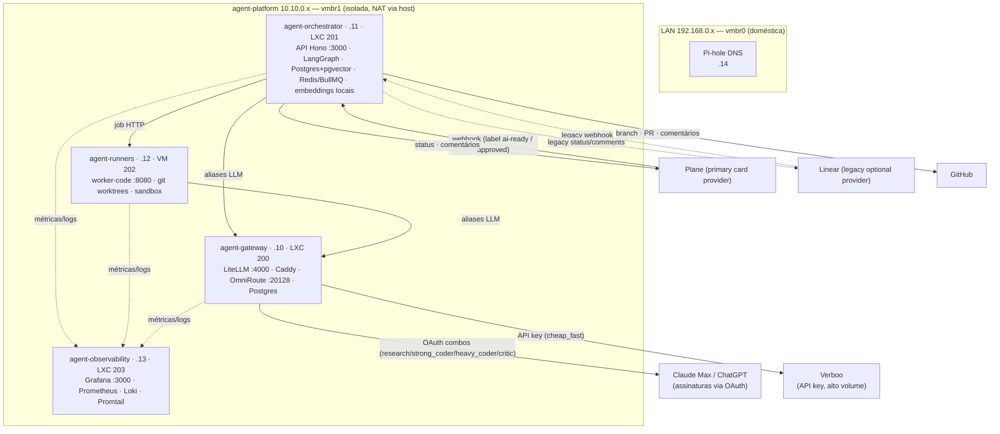
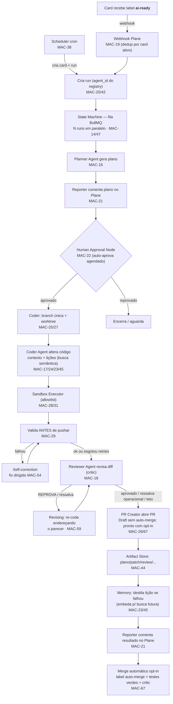

# Arquitetura — visão completa

Mapa único do sistema: o que está no ar, o fluxo ponta a ponta, e como cada
card do Plane (workspace `attodev`, projeto **Agent Platform** / `AGP`) se
encaixa na estrutura. Linear fica como provider opcional legado e só entra no
mapa quando existe card histórico ou suporte explícito em `/webhooks/linear`.

> Estado em 2026-06-21. Legenda: ✅ feito · 🏗 no ar/parcial · ⏳ pendente.
> **Fases 0–7 completas** — projeto deployado em prod; auto-merge opt-in,
> loop critic até 3 voltas, identidade de commits do agente e dashboards
> validados com E2E real.

---

## 1. Topologia de deploy (infra)

**Estado da infra:** as 4 VMs provisionadas, no ar e deployadas. Gateway com OmniRoute
(OAuth) + Verboo + virtual key dedicada (MAC-15); orchestrator com Postgres+pgvector
(migrations 0000→0009) e embeddings locais; Plane é o provider primário e
`/webhooks/linear` segue disponível como legado/optional via Tailscale Funnel.

---

## 2. Fluxo ponta a ponta (DoD do projeto)

Grafo LangGraph: `planning → [⏸ aprovação] → coding → reviewing → [revisar? → revising → reviewing] → pr → merging → report → END`
(falha do coder curto-circuita para `report`). Atravessando tudo: **Context Builder**
(MAC-24), **Memory Layer** (MAC-23/45 — lições por repo, recuperadas por similaridade),
**Self-correction** (MAC-54 — fix intra-run), **Loop de revisão** (MAC-59), **Retry
Engine** (MAC-33), **Workflow Persistence** (MAC-34), **Cost Guard** (MAC-40) e o
gateway de modelos (Fase 2). Catálogos: **Agent/Tool Registry** (MAC-42/43, metadado +
FK, não executam — o grafo segue em código). Concorrência: `AGENT_MAX_CONCURRENCY`
runs simultâneos, observável em `GET /admin/concurrency` (MAC-47).

Plane (primary card provider) -> Orchestrator API -> agent-runners -> GitHub PR -> Plane report
Linear remains supported as an optional provider for legacy cards through `/webhooks/linear`.

---

## 3. Componente → card → código

| Componente | Card(s) | Local no repo | Estado |
|---|---|---|---|
| Decisões/ADRs | MAC-6 | `docs/decisions/` | ✅ |
| Infra Proxmox (4 VMs, rede, deploy) | MAC-8/9/10/11 | `infra/proxmox/`, `infra/deploy/` | ✅ no ar |
| LiteLLM Gateway | MAC-12 | `infra/compose/gateway/` | ✅ no ar |
| Provider Verboo (`cheap_fast`) | MAC-13 | `infra/compose/gateway/litellm-config.yaml` | ✅ configurado |
| Provider OmniRoute/OAuth (`research`/`strong_coder`/`heavy_coder`/`critic`) | MAC-48 | `infra/compose/gateway/` + ADR-0006 | ✅ OAuth feito |
| Budgets / Rate limits | MAC-15 | `litellm-config.yaml` + `docs/runbooks/litellm-guardrails.md` | ✅ aplicados |
| API + Webhooks Plane/Linear (legacy optional) | MAC-19 | `apps/orchestrator-api/src/routes/webhooks.ts` | ✅ |
| Fluxo ai-ready | MAC-20 | `apps/orchestrator-api` (enfileirar) | ✅ |
| State Machine | MAC-14 | `packages/graph` + schema `runs/run_steps` | ✅ (planning→coding→reviewing→pr→report) |
| Planner / Coder / Reviewer / Reporter | MAC-16/17/18/21 | `packages/graph/src/nodes`, `apps/worker-code` (code-gen) | ✅ |
| Human Approval Node | MAC-22 | `packages/graph` (interruptBefore) + tabela `approvals` | ✅ |
| Context Builder | MAC-24 | `apps/worker-code/src/executor/context.ts` | ✅ (convenções + arquivos-exemplo) |
| Memory Layer | MAC-23 | `packages/memory`, `apps/orchestrator-api` (lessons) | ✅ (feedback learning: lições por repo) |
| Retry / Persistence | MAC-33/34 | `packages/llm` (retry), `packages/graph` (checkpointer), `worker.ts` (resume) | ✅ |
| Branch / PR / Worktree | MAC-25/26/27 | `packages/github`, `packages/graph/src/nodes/pr.ts`, `apps/worker-code/src/executor/worktree.ts` | ✅ |
| Sandbox Executor / Test Runner / Self-correction | MAC-28/29 (+fix loop) | `apps/worker-code` (`sandbox.ts`, runJob + allowlist + applyFix) | ✅ (produção usa containers Docker efêmeros; valida antes de pushar; corrige até `AGENT_MAX_FIX_ATTEMPTS`) |
| Observabilidade (painéis, registro) | MAC-35/36 | `infra/compose/observability/provisioning/`, `apps/orchestrator-api` (runs/steps) | ✅ dashboards com execuções, sandbox, custo, auto-merge e critic |
| Segurança (vault, allowlist, kill switch) | MAC-30/31/32 | `killswitch.ts`, `routes/admin.ts`, `worker-code/.../commandPolicy.ts`, `docs/runbooks/secrets.md` | ✅ |
| Loop de revisão (critic re-coda) | MAC-59 | `packages/graph` (nó `revising` + `decideAfterReview`) | ✅ até 3 voltas (`AGENT_MAX_REVIEW_ROUNDS=3`) |
| Auto-merge opt-in | MAC-67 | `packages/graph/src/nodes/merging.ts`, `report.ts`, webhooks do provedor de cards | ✅ prod E2E: `MAC-84`/`MAC-85`, branch deletada e issue `Done` |
| Runtime (queue, scheduler, workers, cost, approval) | MAC-37/38/39/40/41 | `apps/orchestrator-api` (BullMQ + cost guard + scheduler), `packages/policy` | ✅ (scheduler `/schedules`, worker manager `/admin/runners` com failover) |
| Agent Registry / Tool Registry | MAC-42/43 | `apps/orchestrator-api` (`agents.ts`/`tools.ts`, `/agents`,`/tools`), migrations 0006/0007 | ✅ catálogos versionados (capabilities; risk+scopes) + seed + MCP read |
| Artifact Store | MAC-44 | `apps/orchestrator-api` (`artifacts.ts`, `/runs/:id/artifacts`), migration 0004 | ✅ |
| Vector Memory | MAC-45 | `apps/orchestrator-api` (`embeddings.ts`/`lessonLoader.ts`), pgvector, migration 0008 | ✅ busca semântica de lições + fallback recência |
| MCP server | MAC-46 | `apps/mcp-server` (stdio facade) | ✅ rodando zero-túnel no Proxmox (docker exec) |
| Multi-Agent Execution | MAC-47 | `apps/orchestrator-api` (worker `concurrency`, `/admin/concurrency`), migration 0009 | ✅ N runs em paralelo + dedup de issue ativa |
| Identidade de commits do agente | pós MAC-67 | `apps/worker-code/src/executor/runJob.ts`, compose runners | ✅ autor `Ranielli Montagna <raniellimontagna@hotmail.com>` + `Co-authored-by: Codex <noreply@openai.com>` |
| Scraping policy + Playwright controlado | AGP-8/AGP-9 | `apps/worker-code/src/executor/scrapingPolicy.ts`, `playwrightResearch.ts` | ✅ policy compartilhada; Playwright só por pedido explícito |

Provider LLM é híbrido: Verboo (MAC-13) + OmniRoute/OAuth (MAC-48) — ver §5 e ADR-0006.

---

## 4. Roadmap por fase

| Fase | Milestone | Cards | Alvo | Estado |
|---|---|---|---|---|
| 0 | Fundação e decisões | MAC-6 | 16/06 | ✅ |
| 1 | Infra Proxmox e rede | MAC-8/9/10/11 (+MAC-7¹) | 23/06 | ✅ |
| 2 | Gateway LiteLLM e provedores | MAC-12/13/48/15 | 30/06 | ✅ |
| 3 | Orquestrador LangGraph | MAC-14/16/17/18/21/22/23/24/33/34 | 10/07 | ✅ completa |
| 4 | Cards, GitHub e Code Runner | MAC-19/20/25/26/27/28/29 | 20/07 | ✅ |
| 5 | Segurança e Observabilidade | MAC-30/31/32/35/36 | 10/08 | ✅ |
| 6 | Runtime e Governança | MAC-37/38/39/40/41 | 24/08 | ✅ |
| 7 | Produção e Escala | MAC-42/43/44/45/46/47 | 07/09 | ✅ |

¹ MAC-7 e MAC-8 têm o mesmo título "Provisionar VM Gateway" (ver §5).

---

## 5. Divergências a validar (evitar surpresa)

1. **MAC-7 duplicado.** ✅ Resolvido — MAC-7 cancelado (duplicata de MAC-8).

2. **Provider LLM híbrido.** ✅ Resolvido — Verboo segue como provider de alto
   volume trivial (MAC-13, alias `cheap_fast`) e OmniRoute via OAuth cobre os
   combos `cost-saver` (`research`/`strong_coder`) e `high-availability`
   (`heavy_coder`/`critic`). Ver ADR-0006.

3. **Fase 4 antecipada.** O `worker-code` (MAC-27/28/29) já tem base pronta na
   Fase 1, porque o deploy dos runners precisava de um app. Cards continuam na
   Fase 4 — só registrar que a base já existe.

4. **Postgres do orchestrator vs Memory Layer.** ✅ Resolvido — `lessons` é tabela
   separada: conhecimento **destilado, cross-run, por repo**, reinjetado no prompt
   do codegen. `run_steps` segue como telemetria bruta por etapa (tempo/custo). Sem
   overlap. Ver `docs/superpowers/specs/2026-06-12-mac-23-memory-layer-design.md`.

---

Fluxo detalhado do agente: [`decisions/FLOW-agent-workflow.md`](./decisions/FLOW-agent-workflow.md).
ADRs: [`decisions/`](./decisions/). Estado vivo da infra: [`runbooks/proxmox-estado-atual.md`](./runbooks/proxmox-estado-atual.md).
