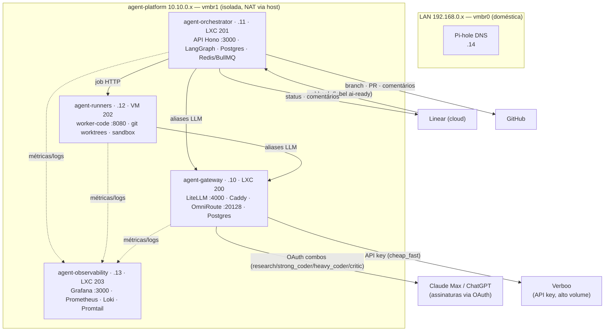
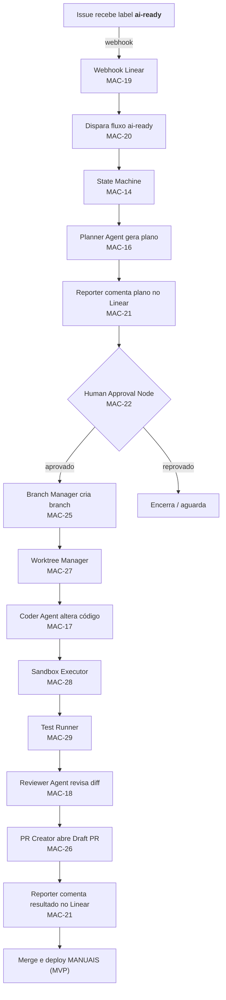

# Arquitetura — visão completa

Mapa único do sistema: o que está no ar, o fluxo ponta a ponta, e como cada
card do Linear (projeto **Orquestrador de Agentes com LangGraph**, time `MAC`)
se encaixa na estrutura. Serve para validar o todo antes de seguir.

> Estado em 2026-06-11. Legenda: ✅ feito · 🏗 no ar/parcial · ⏳ pendente.

---

## 1. Topologia de deploy (infra)

**Estado da infra (Fase 1):** as 4 VMs provisionadas e no ar. Deploy: observability
✅ e runners ✅ rodando; gateway e orchestrator ⏳ aguardando secrets/OAuth.

---

## 2. Fluxo ponta a ponta (DoD do projeto)

Atravessando tudo: **Context Builder** (MAC-24), **Memory Layer** (MAC-23),
**Retry Engine** (MAC-33), **Workflow Persistence** (MAC-34) e o gateway de
modelos (Fase 2).

---

## 3. Componente → card → código

| Componente | Card(s) | Local no repo | Estado |
|---|---|---|---|
| Decisões/ADRs | MAC-6 | `docs/decisions/` | ✅ |
| Infra Proxmox (4 VMs, rede, deploy) | MAC-8/9/10/11 | `infra/proxmox/`, `infra/deploy/` | no ar; deploy parcial |
| LiteLLM Gateway | MAC-12 | `infra/compose/gateway/` | config pronta; ⏳ deploy |
| Provider Verboo (`cheap_fast`) | MAC-13 | `infra/compose/gateway/litellm-config.yaml` | config pronta; ⏳ key |
| Provider OmniRoute/OAuth (`research`/`strong_coder`/`heavy_coder`/`critic`) | MAC-48 | `infra/compose/gateway/` + ADR-0006 | config pronta; ⏳ OAuth |
| Budgets / Rate limits | MAC-15 | `litellm-config.yaml` + `docs/runbooks/litellm-guardrails.md` | config pronta; ⏳ aplicar chaves virtuais |
| API + Webhook Linear | MAC-19 | `apps/orchestrator-api/src/routes/webhooks.ts` | ✅ |
| Fluxo ai-ready | MAC-20 | `apps/orchestrator-api` (enfileirar) | ✅ |
| State Machine | MAC-14 | `packages/graph` + schema `runs/run_steps` | ✅ (planning→coding→reviewing→pr→report) |
| Planner / Coder / Reviewer / Reporter | MAC-16/17/18/21 | `packages/graph/src/nodes`, `apps/worker-code` (code-gen) | ✅ |
| Human Approval Node | MAC-22 | `packages/graph` (interruptBefore) + tabela `approvals` | ✅ |
| Context Builder | MAC-24 | `apps/worker-code/src/executor/context.ts` | ✅ (convenções + arquivos-exemplo) |
| Memory Layer | MAC-23 | `packages/memory` | ⏳ |
| Retry / Persistence | MAC-33/34 | `packages/llm` (retry), `packages/graph` (checkpointer), `worker.ts` (resume) | ✅ |
| Branch / PR / Worktree | MAC-25/26/27 | `packages/github`, `packages/graph/src/nodes/pr.ts`, `apps/worker-code/src/executor/worktree.ts` | ✅ |
| Sandbox Executor / Test Runner | MAC-28/29 | `apps/worker-code` (runJob + allowlist) | ✅ |
| Observabilidade (painéis, registro) | MAC-35/36 | `infra/compose/observability/provisioning/`, `apps/orchestrator-api` (runs/steps) | registro ✅; painéis provisionados (verificar UI) |
| Segurança (vault, allowlist, kill switch) | MAC-30/31/32 | `killswitch.ts`, `routes/admin.ts`, `worker-code/.../commandPolicy.ts`, `docs/runbooks/secrets.md` | ✅ |
| Runtime (queue, scheduler, workers, cost, approval) | MAC-37/38/39/40/41 | `apps/orchestrator-api` (BullMQ + cost guard), `packages/policy` | queue/cost/approval ✅; scheduler(38)/workers(39) ⏳ |
| Escala (registries, artifacts, vector, MCP, multiagente) | MAC-42..47 | `packages/*`, `apps/*` | ⏳ |

Provider LLM é híbrido: Verboo (MAC-13) + OmniRoute/OAuth (MAC-48) — ver §5 e ADR-0006.

---

## 4. Roadmap por fase

| Fase | Milestone | Cards | Alvo | Estado |
|---|---|---|---|---|
| 0 | Fundação e decisões | MAC-6 | 16/06 | ✅ |
| 1 | Infra Proxmox e rede | MAC-8/9/10/11 (+MAC-7¹) | 23/06 | 🏗 no ar; deploy parcial |
| 2 | Gateway LiteLLM e provedores | MAC-12/13/48/15 | 30/06 | 🏗 no ar; OAuth feito |
| 3 | Orquestrador LangGraph | MAC-14/16/17/18/21/22/23/24/33/34 | 10/07 | 🏗 só MAC-23 (memory) ⏳ |
| 4 | Linear, GitHub e Code Runner | MAC-19/20/25/26/27/28/29 | 20/07 | ✅ |
| 5 | Segurança e Observabilidade | MAC-30/31/32/35/36 | 10/08 | ✅ (painéis: verificar UI) |
| 6 | Runtime e Governança | MAC-37/38/39/40/41 | 24/08 | 🏗 37/40/41 ✅; 38/39 ⏳ |
| 7 | Produção e Escala | MAC-42/43/44/45/46/47 | 07/09 | ⏳ |

¹ MAC-7 e MAC-8 têm o mesmo título "Provisionar VM Gateway" (ver §5).

---

## 5. Divergências a validar (evitar surpresa)

1. **MAC-7 duplicado.** ✅ Resolvido — MAC-7 cancelado (duplicata de MAC-8).

2. **Provider LLM híbrido.** ✅ Resolvido — Verboo segue como provider de alto
   volume trivial (MAC-13, alias `cheap_fast`) e OmniRoute via OAuth cobre os
   combos `cost-saver` (`research`/`strong_coder`) e `high-availability`
   (`heavy_coder`/`critic`). Ver ADR-0006.

3. **Fase 4 antecipada.** O `worker-code` (MAC-27/28/29) já tem base pronta na
   Fase 1, porque o deploy dos runners precisava de um app. Cards continuam na
   Fase 4 — só registrar que a base já existe.

4. **Postgres do orchestrator vs Memory Layer.** Schema `runs/run_steps/approvals`
   (MAC-14/22) já existe em `apps/orchestrator-api`. MAC-23 (Memory Layer) é
   camada separada; confirmar fronteira entre os dois.

---

Fluxo detalhado do agente: [`decisions/FLOW-agent-workflow.md`](./decisions/FLOW-agent-workflow.md).
ADRs: [`decisions/`](./decisions/). Estado vivo da infra: [`runbooks/proxmox-estado-atual.md`](./runbooks/proxmox-estado-atual.md).
